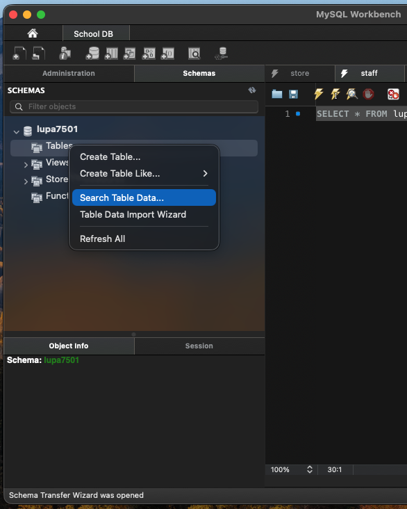
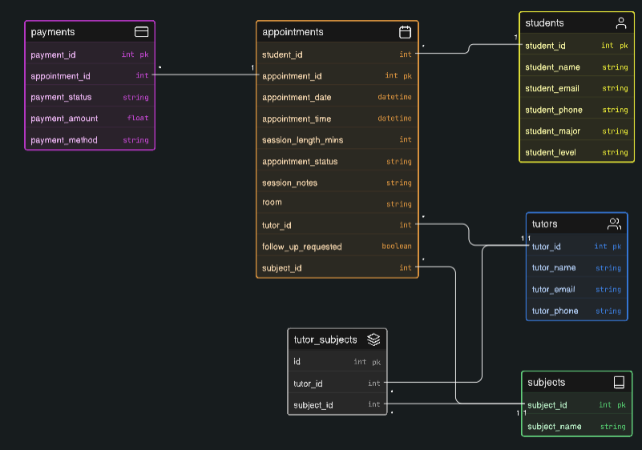

> [!TIP]
> The [issue board](https://github.com/users/lucaspatenaude/projects/6) has the most comprehensive overview of the tasks we need to do. When looking for issues or documentation please use and refer to that rather than this README and the Google Doc. It's the quickest way to track and document tasks so we'll work from there and fill in the README and Google Doc as we go and make changes

📌 **Go to Issue Board:** https://github.com/users/lucaspatenaude/projects/6

📝 **Go to Google Doc** https://docs.google.com/document/d/1PuPcGoOKlvk9pZ30YGDimn-AYu-82sCV4qTlrNP4Wmg/edit?usp=sharing

> [!WARNING]
> Don't use the `/Starting Data (DO NOT TOUCH)` folder. It's best for us to keep a preserved copy initial database as reference point for when we do documentation later. Be sure you're working with `/Modified Data (WORK HERE)`, and creating branches when doing changes in order to not lose changes.

# 🐾 First Steps

1. Download the `.csv` and `.sql` files from `Modified Data (WORK HERE)`
2. Import into MySQLWorkbench
3. Open the CU Database w/ VPN on
4. Drop all tables to reset database (do each startup)
5. Right-click on the "Tables" item in the "Schemas" tab on the left hand side of workbench

6. In the opened window, click the "browse" button and point it at the path of the `.csv` file

# 1. 🏃 Overview of Starting Database

## 📊 Starting DB Diagram

[diagram here]

## 📊 Modified DB Diagram

## ❌ Issues with Database

1. Issue #1
2. Issue #2
3. Issue #3

# 2. ✏️ Planned Changes to Database

### 🗄️ Created Tables

#### 1. Created Table 1

- [ ] Created Table 1

`SQL INSERT STATEMENT HERE`

#### 2. Created Table 2

- [ ] Created Table 2

`SQL INSERT STATEMENT HERE`
  
### 🔗 Relationships

#### Table 1 Relationships

- [ ] Table 1 --> Table 2 

`SQL INSERT STATEMENT HERE`

- [ ] Table 1 --> Table 3 

`SQL INSERT STATEMENT HERE`

#### Table 2 Relationships

- [ ] Table 2 --> Table 3 

`SQL INSERT STATEMENT HERE`

# 3. 🏁 Modified Database

